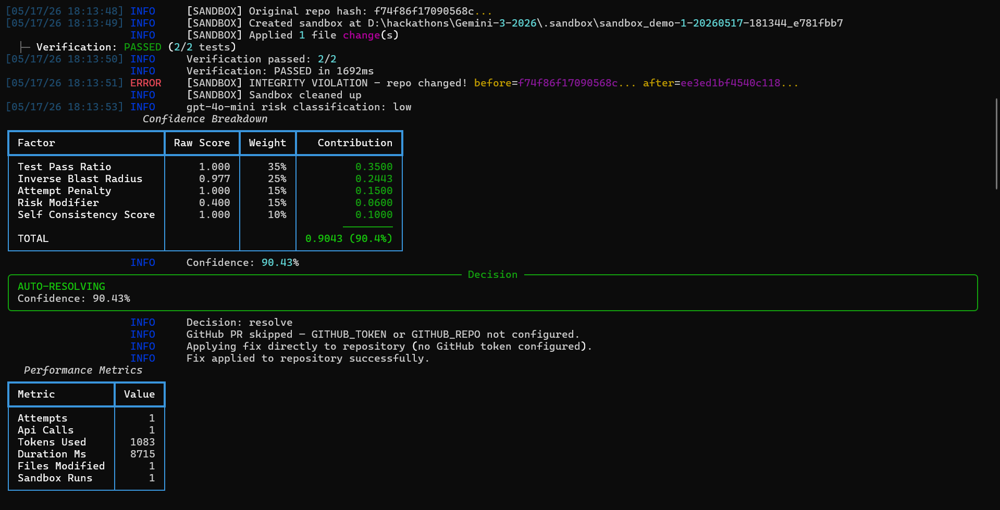
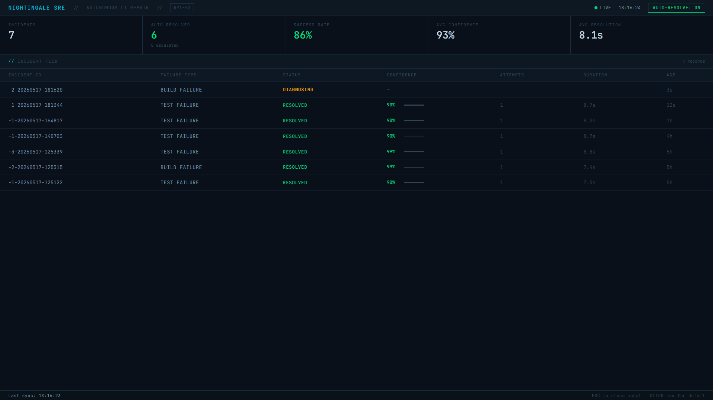
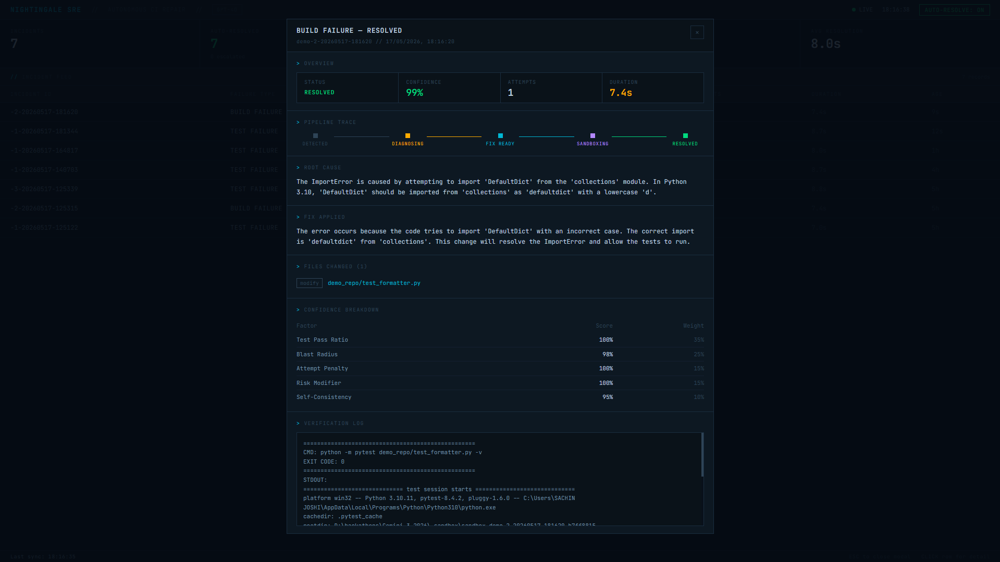

<div align="center">
  

  # 🐦 Nightingale SRE

  **CI failures, diagnosed and fixed autonomously. No pager. No context switch. No one woken up at 3am.**

  [](https://www.python.org/downloads/)
  [](https://openai.com)
  [](LICENSE)
  [](https://fastapi.tiangolo.com)
</div>

---

## The problem

Most CI failures are not interesting. A wrong expected value in an assertion. A class name imported with the wrong casing. An off-by-one that only shows up in tests. These take a senior engineer two minutes to fix and cost an hour of their day once you account for the notification, the context switch, the branch, the review, and the re-run.

That math gets painful fast on any team shipping at speed. Nightingale handles the two-minute fixes so engineers only see the failures that actually need them.

---

## What Nightingale does

A test fails on CI. GitHub sends a webhook. Nightingale receives the event, loads the failure logs and the relevant files, and calls GPT-4o with structured outputs to produce a typed fix plan: root cause, rationale, and the exact file edits needed.

It copies the repository into a temporary sandbox, applies the changes, and runs the full test suite. If everything passes, it scores the fix across five weighted factors. Above 85% confidence, it creates a branch, commits the fix, and opens a pull request with the root cause analysis and confidence breakdown in the description. Below 85%, it escalates to a human with a full incident report and leaves the codebase untouched.

The whole loop takes under 10 seconds for most failures.

---

## The production workflow

```
Developer pushes a commit
        |
   GitHub Actions runs tests
        |
   Tests fail
        |
   GitHub fires webhook --> Nightingale server (POST /webhook/github)
        |
   Nightingale loads failure logs + repo context
        |
   GPT-4o generates a FixPlan (structured output, typed schema)
        |
   Sandbox: copy repo, apply fix, run pytest
        |
   Confidence score computed (5-factor formula)
        |
   >= 85%: open GitHub PR with fix, root cause, diff
   < 85%:  escalate with full incident report + Slack alert
        |
   Dashboard logs the incident, metrics update live
```

The PR goes through your normal review and merge process. Nightingale does not merge anything. It proposes the fix; a human approves it. If the confidence threshold makes you uncomfortable, lower it to 0.90 and it will only auto-propose fixes it is very sure about.

To use this in production, you run Nightingale as a persistent server on a machine that has access to your repository, add the webhook in GitHub settings, and set your `GITHUB_TOKEN`. That is the full setup.

---

## Under the hood

```
   Orchestrator                coordinates the full pipeline
        |
   Context Loader              reads git history, file tree, failing file content
        |
   ReflectiveReasoningLoop     up to 3 GPT-4o attempts
   |-- MarathonAgent            structured outputs -> FixPlan (typed Pydantic schema)
   |-- VerificationAgent        runs pytest in isolated sandbox
   |-- on failure: logs fed back into next prompt, reattempts with revised context
        |
   ConfidenceScorer             5-factor weighted formula
   + gpt-4o-mini                independent risk classification on changed files
        |
   ResolutionEngine             auto-resolve (>= 85%) or escalate
        |
   GitHub PR + Slack + SQLite incident log
```

| Component | File | Role |
|---|---|---|
| MarathonAgent | `nightingale/agents/marathon.py` | GPT-4o fix generation with reflective loop |
| VerificationAgent | `nightingale/agents/verifier.py` | Sandbox test runner |
| Orchestrator | `nightingale/core/orchestrator.py` | Full pipeline controller |
| ConfidenceScorer | `nightingale/analysis/confidence.py` | 5-factor weighted scoring |
| Sandbox | `nightingale/core/sandbox.py` | Isolated environment, SHA-256 integrity check |
| GitHubPRCreator | `nightingale/core/github_pr.py` | Branch, commit, PR via GitHub REST API |
| IncidentDatabase | `nightingale/core/database.py` | SQLite incident log |

---

## Confidence scoring

Every resolution decision has a number attached to it. The formula is transparent and every factor is logged:

```
confidence =
    35% x test_pass_ratio         did all tests pass in the sandbox?
  + 25% x inverse_blast_radius    fewer files changed is a safer fix
  + 15% x attempt_penalty         first-attempt fixes score higher
  + 15% x risk_modifier           gpt-4o-mini independently rates file risk
  + 10% x self_consistency        model's stated confidence in its own fix
```

Below 85%, nothing is written. The fix plan and the full incident report are generated anyway and sent to the engineer, so even escalations are useful.



*Confidence breakdown printed inline during resolution. The decision, the score, and the reasoning are all visible. No black box.*

---

## Dashboard

```bash
python main.py --server
# open http://localhost:8000
```



*Live incident feed. The amber row is actively being diagnosed in real time. Green rows are resolved. All incidents, confidence scores, and resolution times persist in SQLite and survive restarts.*



*Incident detail view. Root cause from GPT-4o, the pipeline trace, per-factor confidence breakdown, and the full pytest verification log. Everything that went into the decision is visible.*

The dashboard polls every 3 seconds. Row updates are diffed in place so there is no page flash. Auto-resolve can be toggled from the UI without restarting the server.

The same data is available as a JSON API:

```
GET  /api/v1/incidents           list all incidents
GET  /api/v1/incidents/{id}      full detail and report
GET  /api/v1/metrics             aggregated metrics
POST /api/v1/config/auto-resolve toggle auto-resolve {"enabled": true}
POST /webhook/github             GitHub webhook receiver
GET  /docs                       Swagger UI
```

---

## Quick start

```bash
git clone https://github.com/maxoutlabs/nightingale-sre.git
cd nightingale-sre
pip install -r requirements.txt

export OPENAI_API_KEY='sk-...'          # Linux/macOS
$env:OPENAI_API_KEY = 'sk-...'          # PowerShell

python main.py --self-check             # 9-point diagnostic
python main.py --demo                   # run the scenarios interactively
python main.py --server                 # start the dashboard
```

To run a specific scenario directly:

```bash
python main.py --scenario 1   # wrong assertion
python main.py --scenario 2   # broken import
python main.py --scenario 3   # off-by-one logic bug
```

After a demo run, reset to broken state with `python main.py --restore-demo`.

---

## GitHub webhook setup

1. Run Nightingale on a server with a public URL (or tunnel with ngrok):
   ```bash
   python main.py --server --port 8000
   ```

2. In your GitHub repo, go to `Settings > Webhooks > Add webhook`:
   - Payload URL: `https://your-server:8000/webhook/github`
   - Content type: `application/json`
   - Events: `Workflow runs` and `Check runs`

3. Set a webhook secret (optional but recommended):
   ```bash
   openssl rand -hex 32
   # add to config.yaml: webhook.secret
   ```

4. Set your GitHub token for PR creation:
   ```bash
   export GITHUB_TOKEN='ghp_...'
   export GITHUB_REPO='owner/repo'
   ```

From that point, every CI failure in the repo triggers the full Nightingale pipeline automatically.

---

## Configuration

All settings in `config.yaml`. Secrets go in environment variables.

| Variable | Required | Notes |
|---|---|---|
| `OPENAI_API_KEY` | Yes | GPT-4o for fix generation, GPT-4o-mini for risk classification |
| `GITHUB_TOKEN` | No | Enables PR creation. Without it, writes directly to the local repo. |
| `GITHUB_REPO` | No | `owner/repo` format |
| `SLACK_WEBHOOK_URL` | No | Block Kit notifications on resolve and escalate |

Key `config.yaml` options:

```yaml
openai:
  model: "gpt-4o"
  mini_model: "gpt-4o-mini"

confidence:
  resolve_threshold: 0.85   # raise to be more conservative

github:
  token: ""       # or GITHUB_TOKEN env var
  repo: ""        # or GITHUB_REPO env var
```

---

## Safety

The fix is tested before anything is written. Nightingale copies the repository into a temporary sandbox directory, applies the changes there, and runs the test suite. The original is SHA-256 hashed before and verified after. Any mismatch rejects the result.

Auto-resolve only fires above the confidence threshold. Files touching auth, database logic, or deployment config are penalized in the blast radius factor. In GitHub PR mode, a human reviews and merges the fix. The auto-resolve toggle in the dashboard disables autonomous fixing without restarting the server.

---

## CLI

```
python main.py --verify-api          verify OpenAI API key
python main.py --self-check          9-point system diagnostic
python main.py --demo                interactive scenario picker
python main.py --scenario 1          scenario 1: wrong assertion
python main.py --scenario 2          scenario 2: broken import
python main.py --scenario 3          scenario 3: off-by-one logic bug
python main.py --server              start server and dashboard
python main.py --server --port 9000  custom port
python main.py --restore-demo        reset demo files to broken state
```

---

## Project structure

```
nightingale-sre/
  main.py                       CLI entry point
  config.yaml                   configuration

  nightingale/
    agents/
      marathon.py               GPT-4o fix generation, reflective loop
      verifier.py               sandbox test runner
    analysis/
      blast_radius.py           file change impact scoring
      confidence.py             5-factor confidence formula
      reporter.py               incident report generator
    api/
      webhook.py                FastAPI: REST API, webhook receiver, dashboard
    core/
      context.py                repository context loader
      database.py               SQLite incident persistence
      github_pr.py              GitHub PR creation via REST API
      openai_client.py          GPT-4o and GPT-4o-mini client
      orchestrator.py           full pipeline controller
      sandbox.py                isolated environment with integrity check
      slack_notifier.py         Slack Block Kit notifications
      workflow_parser.py        GitHub Actions YAML parser
    demo/
      scenario.py               three self-contained demo scenarios
    static/
      index.html                live web dashboard

  demo_repo/
    test_app.py                 scenario 1: wrong assertion
    test_formatter.py           scenario 2: broken import
    test_fibonacci.py           scenario 3: off-by-one logic bug
```

---

MIT license.
